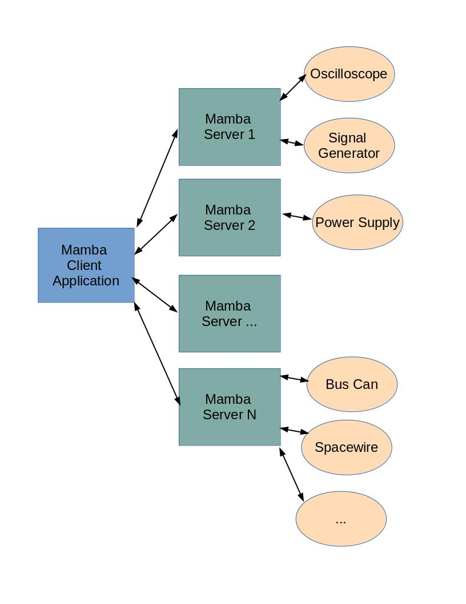

================
Mamba-Server
================

.. image:: https://img.shields.io/pypi/v/Mamba-Server.svg
        :target: https://pypi.python.org/pypi/Mamba-Server
.. image:: https://img.shields.io/readthedocs/mamba-server.svg
        :target: https://readthedocs.org/projects/mamba-server/builds/
        :alt: Documentation Status

Mamba Framework Overview
========================

Mamba is a framework for data acquisition in distributed test environments. The Mamba Framework is composed of:
  
- **Mamba Server**: A tool to develop the controllers for the different Ground Control Equipments.
- **Mamba Client**: A set of libraries for composing a central controller that can use the services provided from one or more Mamba Servers. The central controller can be writen in a Jupyter Notebook, in a traditional development environment (like Visual Code or PyCharm) or be executed as an stand-alone script (https://github.com/mamba-framework/mamba-client-docs).
- **Mamba Utils**: A set of utilities that are useful in the development of Ground Testbeds, like UDP and TCP sniffers (https://github.com/mamba-framework/mamba-utils).

The next image shows an architectural example of a testbed implemented with the Mamba Framework:

Where each Mamba Server can run in the same or different computers and be located in the same building or in different countries.

Mamba Server Overview
=====================
Mamba Server is a tool for the development of Ground Test Equipment Controllers. The Mamba Server is implemented in Python and has a component based architecture. 

While it has been developed to serve the needs of spacecraft equipment test applications, it can also be used in any other kind of project that require the control of different test equipments, like a physics experiment laboratory or in the Automotion industry.

Although the projects where Mamba is deployed usually are composed of dozens of different distributed ground equipments, it is also a perfect fit a an small project composed only by a handful of instruments controlled by one single computer.

Requirements
------------

* Python 3.6+
* Works on Linux, Windows and macOS

License
=======

Mamba Server is dual-licensed under commercial and open source licenses. The commercial Mamba license gives you the full rights to create and distribute software on your own terms without any open source license obligations. With the commercial license you also have access to the official Mamba Support and close strategic relationship with The Mamba Company to make sure your development goals are met. See `License <https://github.com/mamba-framework/mamba-server-docs/blob/master/LICENSE>`__.

Mamba Server  is also available under GPL and LGPLv3 open source licenses. Mamba tools and some libraries are only available under GPL. The Mamba open source licensing is ideal for use cases such as open source projects with open source distribution, student/academic purposes, hobby projects, internal research projects without external distribution, or other projects where all (L)GPL obligations can be met.

In order to preserve the true meaning of open development and uphold the spirit of free software, it is imperative that the rules and regulations of open source licenses required by the Free Software Foundation are followed. Learn more: http://www.gnu.org/licenses.

When deciding which license to use, please check your corporate open source policy or consult a SW licensing legal expert.

Install
=======

The GPL and LGPLv3 version of Mamba Server can be installed from PyPI:

    pip install mamba-server

The wheels include a copy of the required parts of the LGPL version of Qt.
    
Documentation
=============

Documentation is available online at https://mamba-server.readthedocs.io and in the ``docs``
directory.
