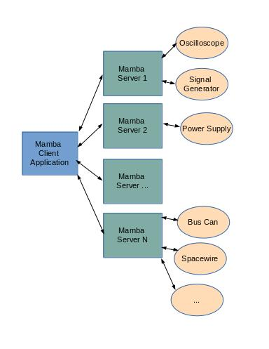

================
Mamba-Server
================

.. image:: https://api.travis-ci.org/mamba-framework/mamba-server.svg?branch=master
   :target: https://travis-ci.org/github/mamba-framework/mamba-server/builds
.. image:: https://img.shields.io/codecov/c/github/mamba-framework/mamba-server/master.svg
   :target: https://codecov.io/github/mamba-framework/mamba-server?branch=master
   :alt: Coverage report
.. image:: https://img.shields.io/pypi/v/Mamba-Server.svg
        :target: https://pypi.python.org/pypi/Mamba-Server
.. image:: https://img.shields.io/readthedocs/mamba-server.svg
        :target: https://readthedocs.org/projects/mamba-server/builds/
        :alt: Documentation Status
.. image:: https://img.shields.io/badge/license-%20MIT-blue.svg
   :target: ../master/LICENSE

Mamba Framework Overview
========================

Mamba is a framework for data acquisition in distributed test environments. The Mamba Framework is composed of:
  
- **Mamba Server**: A tool to develop the controllers for the different Ground Control Equipments.
- **Mamba Client**: A set of libraries for composing a central controller that can use the services provided from one or more Mamba Servers (https://github.com/mamba-framework/mamba-client).
- **Mamba Utils**: A set of utilities that are useful in the development of Ground Testbeds, like UDP and TCP sniffers (https://github.com/mamba-framework/mamba-utils).

The next image shows an architectural example of a testbed implemented with the Mamba Framework:

Where each Mamba Server can run in the same or different computers and be located in the same building or in different countries.

Mamba Server Overview
=====================
Mamba Server is a tool for the development of Ground Test Equipment Controllers. The Mamba Server is implemented in Python and has a component base architecture. 

While it has been developed to serve the needs of spacecraft equipment test applications, it can also be used in any other kind of project that require the control of different test equipments. Although the projects where Mamba is deployed usually are composed of dozens of different distributed ground equipments, it is also a perfect fit a an small project composed only af a handful of instruments controlled by one single computer.

Requirements
------------

* Python 3.6+
* Works on Linux, Windows and macOS

Install
=======

The quick way::

    pip install mamba-server
    
See the install section in the documentation at
https://mamba-server.readthedocs.io/en/latest/installation.html for more details.
    
Documentation
=============

Documentation is available online at https://mamba-server.readthedocs.io and in the ``docs``
directory.

License
=======

See `License <https://github.com/mamba-framework/mamba-server/blob/master/LICENSE>`__.
