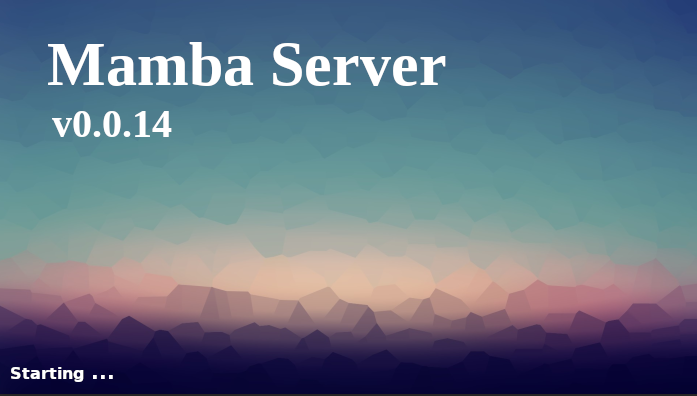
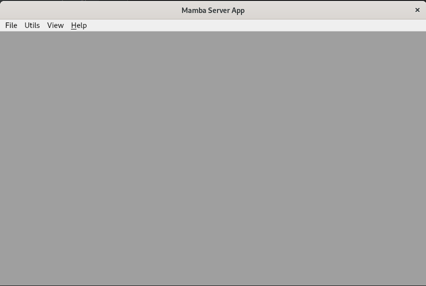

.. Set Up PyCharm

==============================
Set Up Mamba Server in PyCharm
==============================

Install PyCharm
===============

PyCharm is a well known editor with Python execution and debug support.

- `Pycharm <https://www.jetbrains.com/pycharm/download/>`__, latest stable version

Configure Mamba Server Project
==============================
Inside PyCharm:

1. Open the project you have created during the "Getting Started" tutorial.
2. Change the environment to the local venv environment of the project, by clicking on the Python version in the status bar and selecting Interpreter Settings.
3. Invoke Run > Edit Configurations, and configure the new project using the Python template as:
    - Script path: venv/bin/mamba
    - Parameters: serve -l composer/project-compose.yml
    - Working directory: <path to example project root>

Validate your setup
===================
1. Invoke Run > Run, and check Mamba Server GUI starts.

And afterward the Mamba GUI:

