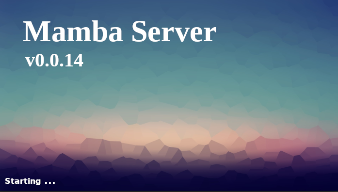
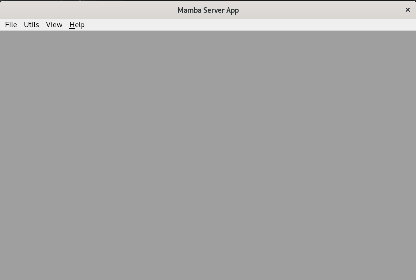

.. Set Up Visual Code

==============================
Set Up Mamba Server in VS Code
==============================

Install VS Code
===============

VS Code is a lightweight editor with Python execution and debug support.

- `VS Code <https://code.visualstudio.com/>`__, latest stable version

Install the Python Extension
============================
1. Start VS Code.
2. Invoke View > Extensions….
3. Type “Python” in the extensions search field, select python in the list, and click Install.

Configure Mamba Server Project
==============================
Inside Visual Code:

1. Open the project you have created during the "Getting Started" tutorial.
2. Change the environment to the local venv environment of the project, by clicking on the Python version in the status bar
3. Invoke Run > Open Configurations, and configure the new project as:

.. code:: json

    {
        "version": "0.2.0",
        "configurations": [
            {
                "name": "Python: Current File",
                "type": "python",
                "request": "launch",
                "program": "venv/bin/mamba",
                "args": ["serve", "-r", "project"],
                "console": "integratedTerminal"
            }
        ]
    }

Validate your setup
===================
1. Invoke Run > Start Debugging, and check Mamba Server GUI starts.

After execution of the previous command the Mamba Server Graphical interface loading window shall be shown:

And afterward the Mamba GUI:

